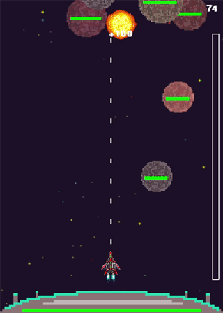

# Interstellar_Escort
 ---
## Game Intro
The year is 2024, and due to unforseen events the world is now uninhabitable (it happended fast... I know). 

Thankfully, Elon Musk's Occupy Mars mission has been gaining steam in recent years and is ready to tackle this monumental task; relocate all of humanity to a new planet. There is just one remaining problem... the Mothership carrying all of humanity across the solar system is in dire need of protection from the dangerous asteroid clusters which it is sure to encounter. Elon knows that there is only one person capable of pulling off such a dangerous mission. It's you! Will you accept your mission to help relocate humanity and navigate the Mothership across the solar system? 

---
## About - version 1.0.0
#### General
Interstellar Escort is a 2D 3rd person shooter game where the objective is to destroy approaching asteroids before they reach the Motherhship. The Mothership's health shielding will allow it to take on a few asteroid hits but ultimately it requires your protection. To protect the ship, it is as simple as moving left and right, as the space ship will fire on its own! While the health of the Mothership determines how long you will be playing, the objective is to gain as high a point total as possible. Your point total increases at a steady rate throughout gameplay but is increased more rapidly by the destruction of asteroids! During your journey through space you will encounter items that will help you on your mission. These special powerups include: health when the Mothership is in dire need, Double XP on occasion to boost your score, and Insta-Kill when the number of asteroids infront of you seems too overwhelming. Good luck!

---
## Demo
 

---
## How-To-Play
#### Installation
This game was written using Python version 3.8.2 and pygame version 1.9.6. In order to install this version of pygame, type within your command prompt:
```bash
    pip install pygame==1.9.6
```
If you already have another pygame version installed, the code may run fine, but backwards compatibility has not been tested.

#### Get Playin'
In order to start playing the game you need to be running python in the directory within which the game is located (be sure to have all the auxillary files containing images, sound, etc. in that location as well). Simply import the module and use:
```python
>>> import Interstellar_Escort
>>> Interstellar_Escort.GameStart()
```
If you are operating from the command prompt then you can do:
```python
>>> python Interstellar_Escort.py
```
Both of these should initiate the game window!

#### Keys
This highly complex game is not for the feable-minded. So tred carefully while glancing over the following game-play instructions...
| Action | Key |
|--------|-----|
| move right | right arrow key |
| move left | left arrow key |

And that's it! Stunningly easy, I know ;)

---
## Version 1.0.0 and future improvements
#### This version
This is the first version of Interstellar Escort. It has currently been debugged to the point where it is a functioning game and shouldn't throw any unexpected errors at the user. There are however some minor flaws in the gameplay which I aim to address in future versions. These include:

* Escalating difficulty: As the game is currently configured, the difficulty setting is not dynamic and remains steady throughout the gameplay. In a future version there will be the addition of discrete levels thats have an increasing difficulty.
* Enhanced pseudo-randomness: The asteroids are generated using a pseudo random number generator to produce an asteroid every X amount of game loops. This randomness occasionally will allow for lulls in game action and you could theoretically go seconds without seeing an asteroid.
* Increased specificity of powerup drops: Current powerup spawning is slightly off to where a powerup might be generated when the user isn't in real need of one.
* Increase repertoire of powerups, spaceships, weapons, and enemys

Feel free to add any contributions that you think will improve game play! I am all ears on suggestions.

---
## Credit and Shout Outs
* Explosion sounds were free of charge from [https://www.freesoundeffects.com/free-sounds](https://www.freesoundeffects.com/free-sounds)
* Big shout out to YouFulca for putting out his game music for free! It was awesome! [Check out his website here](https://wingless-seraph.net/en/index.html)
* Another shout out to Hexidecimalwtf for the free backgrounds. [Check out some of his stuff here](https://hexadecimalwtf.itch.io/space-pixels)
* The 2D pixel spaceship sprites were purchased on [gamedevmarket.net](gamedevmarket.net). The author of those images is dylestorm. He does some really awesome work and you can check out his profile [here](https://www.gamedevmarket.net/member/dylestorm/)
* No credit is necessary for the Mothership or the asteroids... as you can probably tell by the poor craftmasnship, they were created by yours truly.
